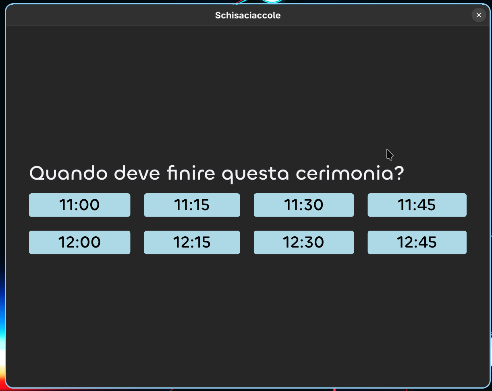
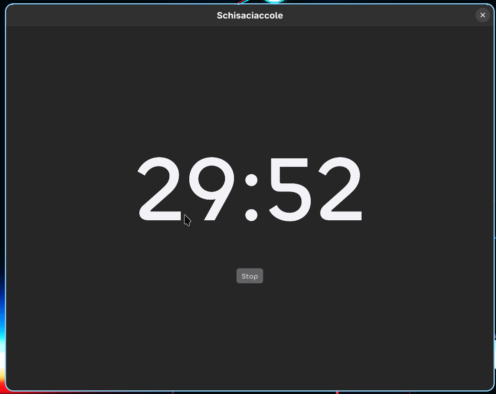

# Schisaciaccole

A countdown timer for **time-boxed Scrum ceremonies**.

Scrum ceremonies are time-boxed: regardless of when the team actually gets into
the meeting room, the meeting should end at its designated time. Schisaciaccole
makes that easy — instead of asking "how long do we have left?", you pick the
**wall-clock time the meeting must end** and the timer counts down precisely to
that moment.

## How it works

When you launch the app it shows the **next 8 quarter-hour marks** (00, 15, 30,
45 past the hour) starting from the upcoming quarter. That covers meetings of up
to **2 hours**.

- The options refresh automatically every 3 seconds, so they are always accurate
  even if the app sits open for a while before the meeting starts.
- Pick the slot when the ceremony has to end.
- The timer counts down to exactly that time and plays a sound when it reaches
  zero.
- Press **Stop** to end early and go back to the selection screen.

Example: it's 09:07 and the daily stand-up must wrap by 09:15. Open the app, tap
`09:15`, and the timer ends precisely at 09:15 — not 15 minutes from when you
pressed the button.

## Screenshots

| Selection | Timer |
|-----------|-------|
|  |  |

## Requirements

- [Rust](https://www.rust-lang.org/tools/install) (stable toolchain, `cargo`)
- The **Chillax** font (see below — not bundled)

## Font setup (required)

The app uses **Chillax** as its default font. It is **not** included in this
repo — you have to download it yourself.

1. Download Chillax: <https://api.fontshare.com/v2/fonts/download/chillax>
2. Unzip it.
3. Place the OTF Medium weight at exactly this path:

   ```
   ui/assets/fonts/Chillax_Variable/Fonts/OTF/Chillax-Medium.otf
   ```

If the file is missing or in the wrong place the build/render will fail to find
the font.

## Build & run

```sh
cargo run
```

For a release build:

```sh
cargo run --release
```

## Logging

The app uses `env_logger`. Control verbosity with the `RUST_LOG` environment
variable (default is `warn`):

```sh
RUST_LOG=info cargo run     # callback events: selection, start/pause, stop, sound
RUST_LOG=debug cargo run    # also the periodic option refresh
```
