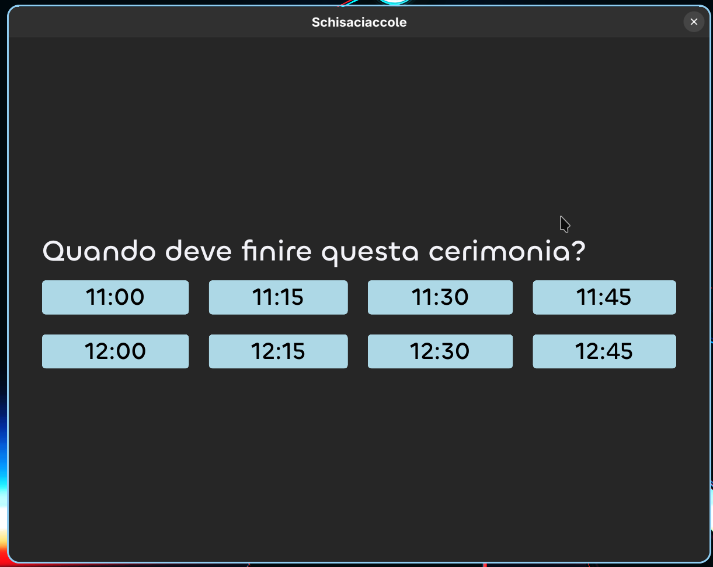
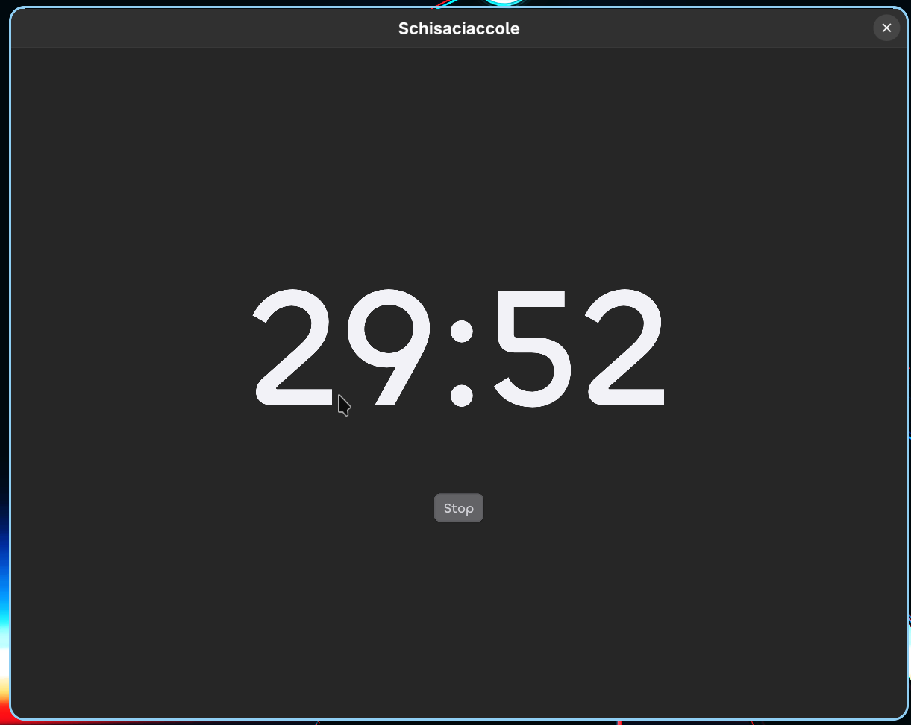

#+TITLE: Schisaciaccole

A countdown timer for *time-boxed Scrum ceremonies*.

Scrum ceremonies are time-boxed: regardless of when the team actually gets into
the meeting room, the meeting should end at its designated time. Schisaciaccole
makes that easy — instead of asking "how long do we have left?", you pick the
*wall-clock time the meeting must end* and the timer counts down precisely to
that moment.

* How it works

When you launch the app it shows the *next 8 quarter-hour marks* (00, 15, 30,
45 past the hour) starting from the upcoming quarter. That covers meetings of
up to *2 hours*.

- The options refresh automatically every 3 seconds, so they are always
  accurate even if the app sits open for a while before the meeting starts.
- Pick the slot when the ceremony has to end.
- The timer counts down to exactly that time and plays a sound when it
  reaches zero.
- Press *Stop* to end early and go back to the selection screen.

Example: it's 09:07 and the daily stand-up must wrap by 09:15. Open the app,
tap =09:15=, and the timer ends precisely at 09:15 — not 15 minutes from when
you pressed the button.

* Screenshots

| Selection                                              | Timer                                        |
|---------------------------------------------------------+-----------------------------------------|
|                 |      |

* Requirements

- [[https://www.rust-lang.org/tools/install][Rust]] (stable toolchain, =cargo=)

The default font (*Plus Jakarta Sans*) is bundled — no extra setup needed.

* Font setup (optional)

The app ships with *Plus Jakarta Sans* bundled, so it works out of the box.

*Chillax* looks nicer and is the preferred font, but it is *not* bundled — to
use it, download it and swap two pairs of commented lines in
[[file:ui/app-window.slint][=ui/app-window.slint=]].

1. Download Chillax: [[https://api.fontshare.com/v2/fonts/download/chillax]]
2. Unzip it.
3. Place the OTF Medium weight at exactly this path:

   #+begin_example
   ui/assets/fonts/Chillax_Variable/Fonts/OTF/Chillax-Medium.otf
   #+end_example

4. In =ui/app-window.slint=, swap the comments on the import lines (top of
   file):

   #+begin_src slint
   import "../assets/fonts/Chillax_Variable/Fonts/OTF/Chillax-Medium.otf";
   // import "../assets/fonts/Plus_Jakarta_Sans/static/PlusJakartaSans-Medium.ttf";
   #+end_src

5. ...and on the =default-font-family= lines inside =MainWindow=:

   #+begin_src slint
   // default-font-family: "Plus Jakarta Sans";
   default-font-family: "Chillax";
   #+end_src

* Build & run

#+begin_src sh
cargo run
#+end_src

For a release build:

#+begin_src sh
cargo run --release
#+end_src

* Packaging

The app icon lives at =assets/icon.png= and the =game_over.mp3= sound ships
as a resource. At runtime the sound is located relative to the executable, so
it works from every package layout (dev, deb, macOS app, Arch pkg).

** Linux (.deb) and macOS (.app) — cargo-bundle

#+begin_src sh
cargo install cargo-bundle          # once

cargo bundle --release --format deb   # Linux  -> target/release/bundle/deb/*.deb
cargo bundle --release --format osx   # macOS  -> *.app (must run on macOS)
#+end_src

Bundle metadata (name, identifier, icon, bundled resources) lives in the
=[package.metadata.bundle]= section of =Cargo.toml=.

** Linux (.deb) via Docker

Building the =.deb= directly needs =cargo-bundle= plus a handful of native
dev libraries (ALSA, fontconfig, xcb...). =Dockerfile.deb= sets up a
throwaway Ubuntu 22.04 image with Rust, =cargo-bundle= and those libraries
pre-installed, so you don't need any of that on the host.

Build the image once:

#+begin_src sh
docker build -t deb-builder -f Dockerfile.deb .
#+end_src

Then run the bundle build, mounting the repo into the container:

#+begin_src sh
docker run --rm \
    --user $(id -u):$(id -g) \
    -e HOME=/tmp \
    -e CARGO_HOME=/tmp/cargo \
    -v "$(pwd)":/app \
    -w /app \
    deb-builder cargo bundle --release --format deb
#+end_src

- =--user $(id -u):$(id -g)= makes the container write files as your host
  user instead of root.
- =HOME= and =CARGO_HOME= are redirected to =/tmp= because the mounted-in
  user has no home directory inside the container.

The resulting package lands at =target/release/bundle/deb/*.deb=, same as
the native =cargo bundle= build.

** Arch Linux (pacman)

pacman can't install a =.deb=. Use the bundled PKGBUILD instead.

#+begin_quote
*Run =makepkg= from inside =packaging/arch/=, never from the repo root.*
makepkg uses =./src= and =./pkg= as its work dirs — at the repo root =./src=
is the crate's own source directory and makepkg would wipe it. The PKGBUILD
builds a clean copy under its own =src/=, so the crate is never touched.
#+end_quote

#+begin_src sh
cd packaging/arch
makepkg -f                  # rustup users without the pacman 'cargo' pkg: makepkg -fd
sudo pacman -U schisaciaccole-*.pkg.tar.zst
#+end_src

This installs the binary, the sound, the icon, a =.desktop= launcher and the
license under the standard =/usr= paths.

* Logging

The app uses =env_logger=. Control verbosity with the =RUST_LOG= environment
variable (default is =warn=):

#+begin_src sh
RUST_LOG=info cargo run     # callback events: selection, start/pause, stop, sound
RUST_LOG=debug cargo run    # also the periodic option refresh
#+end_src
